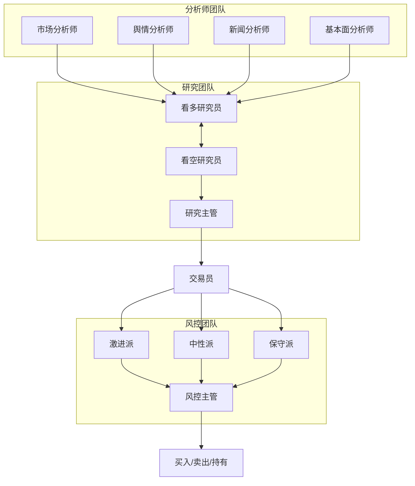

# TradingCrew: 多智能体 LLM 金融交易框架

> **注意**: 本项目基于 [TradingAgents](https://github.com/TauricResearch/TradingAgents)
> (TauricResearch, Apache 2.0) 衍生开发，新增了 Web GUI 和 A 股市场支持。

---

## 架构



---

## 概述

TradingCrew 是一个模拟真实交易公司运作的多智能体交易框架。通过部署专业化的 LLM 智能体（包括基本面分析师、情绪分析师、技术分析师、交易员和风控团队），平台协作评估市场状况并做出交易决策。智能体之间通过动态辩论来确定最优策略。

> TradingCrew 框架仅供研究用途。交易表现受多种因素影响，包括所选的语言模型、模型温度、交易周期、数据质量等。本框架不构成任何金融、投资或交易建议。

### 支持的市场

| 市场 | 代码格式 | 数据源 | 示例 |
|------|---------|--------|------|
| A股 | 6位数字 | AKShare | 600519, 000858 |
| 美股 | 字母代码 | yfinance | AAPL, NVDA |
| 港股 | 数字.HK | yfinance | 0700.HK |

### 支持的模型

| 模型 | 提供商 | 说明 |
|------|--------|------|
| deepseek-v3 | 阿里云百炼 | DeepSeek V3 (中国推荐) |
| qwen3-max | 阿里云百炼 | 通义千问 3 Max |
| gpt-4o | OpenRouter | OpenAI GPT-4o (国际推荐) |
| claude-sonnet-4 | OpenRouter | Anthropic Claude Sonnet 4 |
| deepseek/deepseek-chat-v3-0324 | OpenRouter | DeepSeek V3 (国际) |

---

## 安装

```bash
git clone https://github.com/almax000/trading-crew.git
cd trading-crew

# 创建虚拟环境
conda create -n tradingcrew python=3.13
conda activate tradingcrew

# 安装依赖
pip install -r requirements.txt

# Web 前端
cd web && bun install
```

### 环境变量

复制 `.env.example` 并配置:

```bash
cp .env.example .env
```

| 变量 | 必需 | 说明 |
|------|------|------|
| `DASHSCOPE_API_KEY` | 推荐 (中国) | 阿里云百炼 API Key |
| `OPENROUTER_API_KEY` | 推荐 (国际) | OpenRouter API Key (400+ 模型) |
| `OPENAI_API_KEY` | 备选 | OpenAI 直连 API Key |
| `INVITE_CODES` | Web | 用户凭据 `user1:pass1,user2:pass2` |
| `ADMIN_USERS` | Web | 管理员 `admin1,admin2` |

---

## 使用

### Web 服务

```bash
# 启动所有服务
./start-dev.sh

# 或者分别启动：
# 启动 Python 分析服务
python -m uvicorn analysis_service.main:app --host 127.0.0.1 --port 8000

# 启动 Web 服务 (另一个终端)
cd web && bun run src/index.ts
```

### Python API

```python
from tradingcrew.graph.trading_graph import TradingCrewGraph
from tradingcrew.market_config import get_dashscope_config

config = get_dashscope_config(market="A-share", model="deepseek-v3")
ta = TradingCrewGraph(config=config)

_, decision = ta.propagate("600519", "2024-01-15")
print(decision)  # BUY / SELL / HOLD
```

---

## API

### 分析服务 (FastAPI - 端口 8000)

| 端点 | 方法 | 说明 |
|------|------|------|
| `/analyze` | POST | 流式分析 (NDJSON) |
| `/analyze/stream` | POST | Token 级流式分析 (SSE) |
| `/health` | GET | 健康检查 |

### Web 服务 (Bun + Hono - 端口 1788)

| 端点 | 方法 | 说明 |
|------|------|------|
| `/api/auth/login` | POST | 用户认证 |
| `/api/sessions` | GET | 列出用户会话 |
| `/api/sessions` | POST | 创建分析会话 |
| `/api/sessions/:id/stream` | GET | SSE 流式会话进度 |
| `/api/sessions/:id/retry` | POST | 重试失败的会话 |
| `/api/sessions/:id` | DELETE | 删除会话 |

**支持的市场:** A股 (6位数字, AKShare)、美股 (字母代码, yfinance)、港股 (数字.HK, yfinance)

**支持的模型:** deepseek-v3、qwen3-max (阿里云百炼), gpt-4o、claude-sonnet-4、deepseek-v3-0324 (OpenRouter)

## 引用

```bibtex
@misc{xiao2025tradingagentsmultiagentsllmfinancial,
      title={TradingAgents: Multi-Agents LLM Financial Trading Framework},
      author={Yijia Xiao and Edward Sun and Di Luo and Wei Wang},
      year={2025},
      eprint={2412.20138},
      archivePrefix={arXiv},
      primaryClass={q-fin.TR},
      url={https://arxiv.org/abs/2412.20138},
}
```
